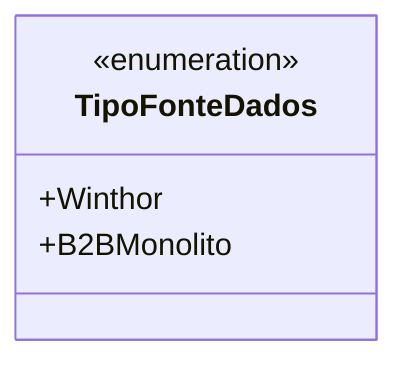

# TipoFonteDados
**Namespace**: IsthmusWinthor.Dominio.Enumeradores  
**Nome do Arquivo**: TipoFonteDados.cs  

O `TipoFonteDados` é um enumerador que define as fontes de dados suportadas pelo sistema. Sua principal finalidade é categorizar as origens de dados que o sistema pode manipular, garantindo que as operações e interações sejam direcionadas corretamente conforme o tipo de fonte selecionada.

## Propriedades Calculadas e de Validação
Não há propriedades calculadas ou de validação nesta classe, pois trata-se de um enumerador simples e direto.

## Tipos Auxiliares e Dependências
- **Enumeradores**: 
  - `[TipoFonteDados](TipoFonteDados.md)`

## Diagrama de Relacionamentos

O diagrama acima representa o enumerador `TipoFonteDados`, que não possui relações com outras classes ou propriedades complexas, sendo um componente autônomo de categorização de fontes de dados.

