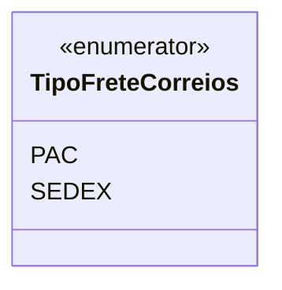

# TipoFreteCorreios
**Namespace**: IsthmusWinthor.Dominio.Enumeradores  
**Nome do Arquivo**: TipoFreteCorreios.cs  

`TipoFreteCorreios` é um enumerador que representa os tipos de frete disponíveis para envio de produtos pelos Correios.

## Tipos Auxiliares e Dependências
- **Enumeradores**:
  - [TipoFreteCorreios](TipoFreteCorreios.md)

## Diagrama de Relacionamentos

---
Gerada em 29/12/2025 21:04:18
