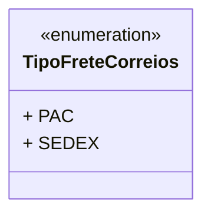

# TipoFreteCorreios
**Namespace**: IsthmusWinthor.Dominio.Enumeradores  
**Nome do Arquivo**: TipoFreteCorreios.cs  

O `TipoFreteCorreios` é um enumerador que representa os tipos de frete disponíveis no sistema. Ele é utilizado para categorizar as diferentes modalidades de envio oferecidas pelos Correios, permitindo ao sistema gerenciar corretamente as opções de frete na lógica de negócios.

## Tipos Auxiliares e Dependências
- **Enumeradores**:
  - `[TipoFreteCorreios](TipoFreteCorreios.md)`

## Diagrama de Relacionamentos

