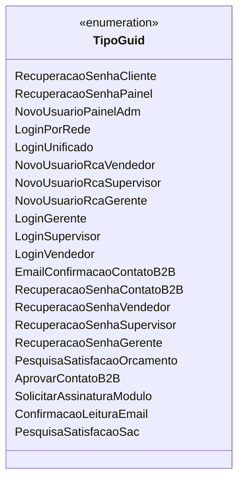

# TipoGuid

**Namespace**: IsthmusWinthor.Dominio.Enumeradores  
**Nome do Arquivo**: TipoGuid.cs  

## Visão Geral e Responsabilidade
A enumeração `TipoGuid` representa uma série de tipos de GUID (Globally Unique Identifier) utilizados para identificar diferentes eventos ou ações no sistema. O objetivo é garantir que cada tipo de ação tenha um identificador único, facilitando o rastreamento e a recuperação de informações relevantes relacionadas a funcionalidades de autenticação, recuperação de senhas e interações do usuário no sistema.

## Métodos de Negócio
A classe `TipoGuid` não contém métodos de negócio, uma vez que é uma definição de enumeração e não possui lógica interna.

## Propriedades Calculadas e de Validação
Esta classe não contém propriedades, pois é composta inteiramente por valores enumerados.

## Navigations Property
A classe `TipoGuid` não contém propertie navigacionais complexas do domínio, visto que se trata apenas de uma enumeração.

## Tipos Auxiliares e Dependências
Não há dependências ou tipos auxiliares utilizados pela classe `TipoGuid`, pois se trata de uma enumeração isolada.

## Diagrama de Relacionamentos

---
Gerada em 29/12/2025 21:04:29
