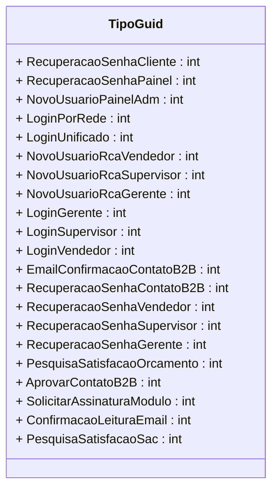

# TipoGuid

**Namespace**: IsthmusWinthor.Dominio.Enumeradores  
**Nome do Arquivo**: TipoGuid.cs  

Este é um enumerador que representa os diferentes tipos de identificadores do sistema, utilizados em diversas operações, como recuperação de senhas, criação de usuários e processos de autenticação.

## Tipos Auxiliares e Dependências
- **Enumeradores**:
  - `[TipoGuid](TipoGuid.md)` - Enum que categoriza as distintas operações no sistema.

## Diagrama de Relacionamentos

