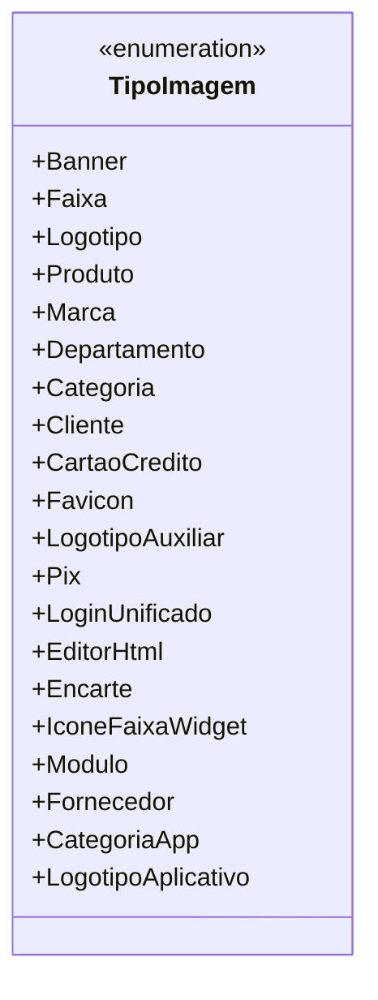

# TipoImagem
**Namespace**: IsthmusWinthor.Dominio.Enumeradores  
**Nome do Arquivo**: TipoImagem.cs  

O `TipoImagem` é um enumerador que define os diferentes tipos de imagens utilizados dentro do sistema. Sua finalidade é proporcionar uma forma clara e padronizada de identificar e categorizar as imagens em um sistema, permitindo que diferentes partes da aplicação tratem essas imagens de forma consistente e entendível.

## Métodos de Negócio
- Este enumerador não contém métodos com lógica de negócio; ele é puramente uma definição de tipos.

## Propriedades Calculadas e de Validação
- Não aplicável, pois este é um enumerador sem propriedades que contenham lógica de cálculo ou validação.

## Navigation Property
- Não há propriedades de navegação, uma vez que este é um tipo enumerado.

## Tipos Auxiliares e Dependências
- Nenhum tipo auxiliar adicional ou dependências são listados para este enumerador.

## Diagrama de Relacionamentos

---
Gerada em 29/12/2025 21:04:37
