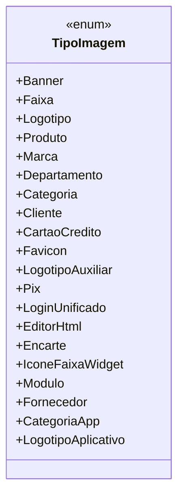

# TipoImagem

**Namespace**: IsthmusWinthor.Dominio.Enumeradores  
**Nome do Arquivo**: TipoImagem.cs  

`TipoImagem` é um enumerador que representa os diferentes tipos de imagens que podem ser utilizados no sistema. Cada valor enum possui um conhecimento semântico específico, ajudando a definir a finalidade e o contexto de uso da imagem dentro do domínio da aplicação.

## Tipos Auxiliares e Dependências
- Nenhuma classe estática ou helper especial.
- Enum: `[TipoImagem](TipoImagem.md)`

## Diagrama de Relacionamentos

