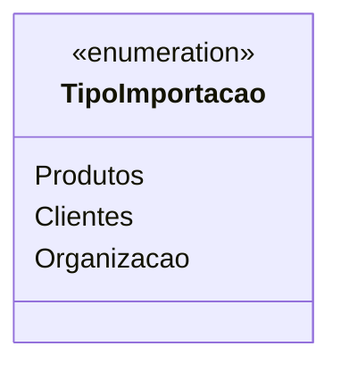

# TipoImportacao
**Namespace**: IsthmusWinthor.Dominio.Enumeradores  
**Nome do Arquivo**: TipoImportacao.cs  

Esta enumeração é utilizada para categorizar os diferentes tipos de importação que podem ser realizados dentro do sistema, facilitando o gerenciamento e controle das operações de dados.

## Tipos Auxiliares e Dependências
- `TipoImportacao`: Enum utilizada para definir os tipos de importação disponíveis.

## Diagrama de Relacionamentos

