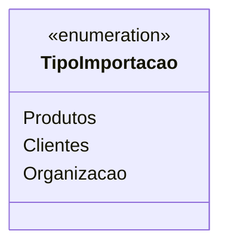

# TipoImportacao

**Namespace**: IsthmusWinthor.Dominio.Enumeradores  
**Nome do Arquivo**: TipoImportacao.cs  

O enumerador `TipoImportacao` define os tipos de importação que podem ser realizados no sistema, categorizando os dados que podem ser importados para facilitar a integração de informações.

## Tipos Auxiliares e Dependências
- Nenhum enumerador adicional.  
- Nenhuma classe estática ou helper associada.  

## Diagrama de Relacionamentos

---
Gerada em 29/12/2025 21:04:41
