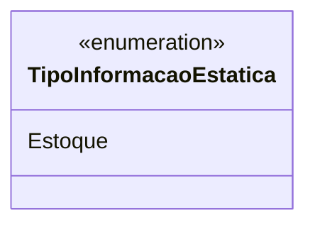

# TipoInformacaoEstatica
**Namespace**: IsthmusWinthor.Dominio.Enumeradores  
**Nome do Arquivo**: TipoInformacaoEstatica.cs  

O `TipoInformacaoEstatica` é um enumerador utilizado para categorizar informações que permanecem constantes dentro do sistema, facilitando a classificação de dados relacionados ao estoque.

## Tipos Auxiliares e Dependências
- Enum: `[TipoInformacaoEstatica](TipoInformacaoEstatica.md)`  

## Diagrama de Relacionamentos

