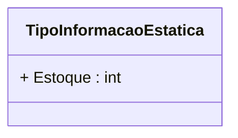

# TipoInformacaoEstatica
**Namespace**: IsthmusWinthor.Dominio.Enumeradores  
**Nome do Arquivo**: TipoInformacaoEstatica.cs  

Este é um enumerador que define tipos de informações estáticas, utilizado na aplicação para categorizar e padronizar a representação de informações que não mudam.

### Tipos Auxiliares e Dependências
- Enumeração: [TipoInformacaoEstatica](TipoInformacaoEstatica.md)

### Diagrama de Relacionamentos

---
Gerada em 29/12/2025 21:04:45
