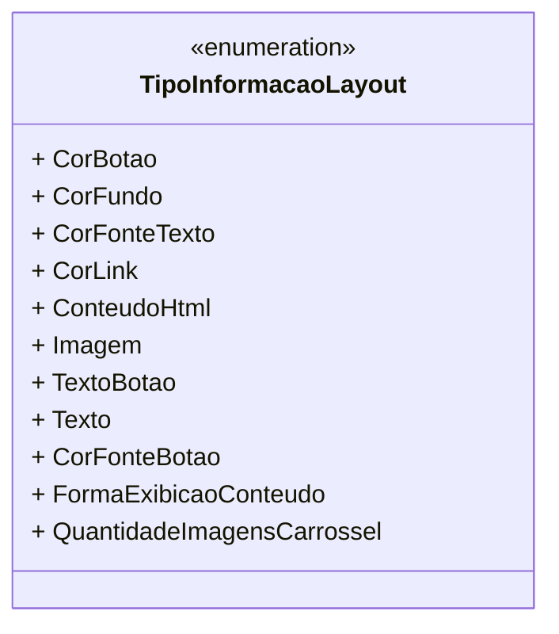

# TipoInformacaoLayout
**Namespace**: IsthmusWinthor.Dominio.Enumeradores  
**Nome do Arquivo**: TipoInformacaoLayout.cs  

O enum `TipoInformacaoLayout` tem como finalidade categorizar diferentes tipos de informações que podem ser utilizadas em layouts de interface, facilitando a configuração e a personalização visual.

## Tipos Auxiliares e Dependências
- **Enumeradores**:
  - `TipoInformacaoLayout`: Enum que define os tipos de informação que podem ser aplicados em um layout. 

## Diagrama de Relacionamentos

---
Gerada em 29/12/2025 21:04:51
