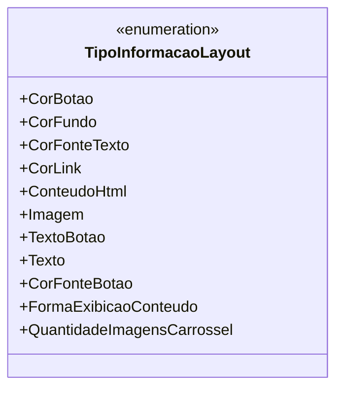

# TipoInformacaoLayout
**Namespace**: IsthmusWinthor.Dominio.Enumeradores  
**Nome do Arquivo**: TipoInformacaoLayout.cs  

O enum `TipoInformacaoLayout` define uma série de constantes que representam diferentes tipos de informações que podem ser utilizadas para a configuração de layouts em uma aplicação. Esses tipos de informação são essenciais para a personalização da interface do usuário e a formatação de conteúdo apresentado na aplicação.

## Tipos Auxiliares e Dependências
- Nenhuma classe estática ou helper, além do próprio enum, é utilizada por esta classe. 

Diagrama de Relacionamentos

