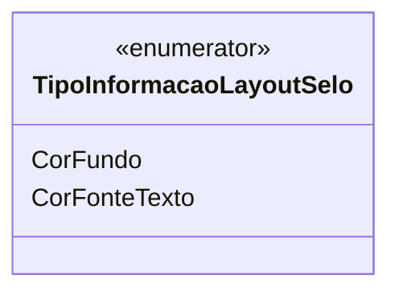

# TipoInformacaoLayoutSelo
**Namespace**: IsthmusWinthor.Dominio.Enumeradores  
**Nome do Arquivo**: TipoInformacaoLayoutSelo.cs  

O `TipoInformacaoLayoutSelo` é um enumerador utilizado para definir os tipos de informações que podem ser aplicadas a um layout de selo, permitindo assim uma tipificação clara das características visuais para a geração de selos.

## Tipos Auxiliares e Dependências
- **Enumeradores**:
  - `[TipoInformacaoLayoutSelo](TipoInformacaoLayoutSelo.md)`  

## Diagrama de Relacionamentos

