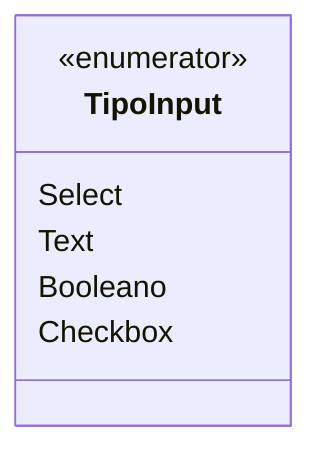

# TipoInput

**Namespace**: IsthmusWinthor.Dominio.Enumeradores  
**Nome do Arquivo**: TipoInput.cs  

O enumerador `TipoInput` é utilizado para definir os diferentes tipos de entrada que podem ser aplicados em um sistema de interface do usuário, facilitando a manipulação e validação de dados conforme o contexto de uso.

## Tipos Auxiliares e Dependências
- **Enumeradores**:
  - `[TipoInput](TipoInput.md)`: Define os tipos de entrada permitidos na aplicação e suas respectivas representações.

## Diagrama de Relacionamentos

