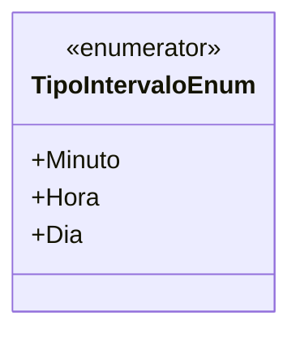

# TipoIntervaloEnum
**Namespace**: IsthmusWinthor.Dominio.Enumeradores  
**Nome do Arquivo**: TipoIntervaloEnum.cs  

O `TipoIntervaloEnum` é uma enumeração que define os diferentes tipos de intervalos que podem ser utilizados dentro do sistema, facilitando a representação e a manipulação de períodos de tempo. 

## Tipos Auxiliares e Dependências
- **Enumeradores**:
  - `[TipoIntervaloEnum](TipoIntervaloEnum.md)`

## Diagrama de Relacionamentos

