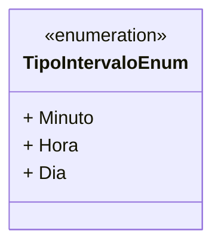

# TipoIntervaloEnum
**Namespace**: IsthmusWinthor.Dominio.Enumeradores  
**Nome do Arquivo**: TipoIntervaloEnum.cs  

## Visão Geral e Responsabilidade
O `TipoIntervaloEnum` é um enumerador que define os tipos de intervalos de tempo utilizados em diversas operações dentro do sistema. Ele categoriza a unidade de tempo em Minutos, Horas e Dias, facilitando a padronização e interpretação de quantidades de tempo em processos relacionados à temporização e agendamento.

## Tipos Auxiliares e Dependências
- Nenhum

## Diagrama de Relacionamentos

---
Gerada em 29/12/2025 21:05:05
