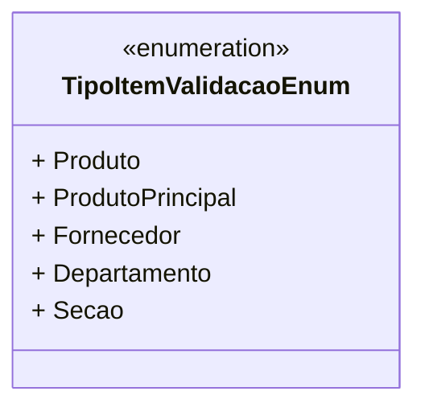

# TipoItemValidacaoEnum
**Namespace**: IsthmusWinthor.Dominio.Enumeradores  
**Nome do Arquivo**: TipoItemValidacaoEnum.cs  

Esta classe é um Enum que define os tipos de itens que podem ser validados dentro do sistema. Sua finalidade reside em categorizar e facilitar a identificação de diferentes entidades que podem requerer validações específicas.

## Tipos Auxiliares e Dependências
- **Enumeradores**:
  - [TipoItemValidacaoEnum](TipoItemValidacaoEnum.md)

## Diagrama de Relacionamentos

---
Gerada em 29/12/2025 21:05:10
