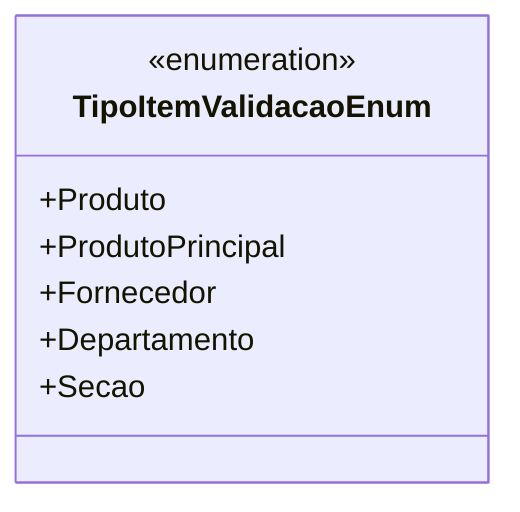

# TipoItemValidacaoEnum
**Namespace**: IsthmusWinthor.Dominio.Enumeradores  
**Nome do Arquivo**: TipoItemValidacaoEnum.cs  

Este enum é utilizado para categorizar diferentes tipos de itens de validação no sistema, desempenhando um papel crucial na lógica de validação de dados e integridade do domínio.

## Tipos Auxiliares e Dependências
- Este enum não possui dependências a classes ou métodos auxiliares, mas é utilizado pela lógica de validação no domínio para identificar tipos específicos de itens que precisam ser validados.

## Diagrama de Relacionamentos

