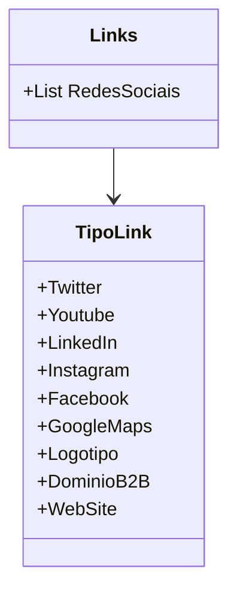

# TipoLink
**Namespace**: IsthmusWinthor.Dominio.Enumeradores  
**Nome do Arquivo**: TipoLink.cs  

O Enum `TipoLink` define os diferentes tipos de links que podem ser utilizados dentro da aplicação, representando tanto redes sociais quanto outras formas de conexão digital.

# Links
**Namespace**: IsthmusWinthor.Dominio.Enumeradores  
**Nome do Arquivo**: Links.cs  

O static class `Links` tem a responsabilidade de agrupar todos os tipos de links relacionados a redes sociais, facilitando seu uso em todo o sistema, centralizando a definição de quais links são considerados redes sociais.

## Métodos de Negócio
### Método: RedesSociais
**Objetivo**: Centralizar e disponibilizar uma lista dos tipos de links correspondentes às redes sociais, garantindo consistência na utilização dessas informações em toda a aplicação.

**Comportamento**: 
- Este método não possui lógica condicional complexa. Ele simplesmente retorna uma lista pré-definida de `TipoLink` que são classificados como redes sociais.

**Retorno**: Um objeto do tipo `List<TipoLink>` que contém os valores das redes sociais disponíveis.

## Tipos Auxiliares e Dependências
- Enumeradores: 
  - `[TipoLink](TipoLink.md)`

## Diagrama de Relacionamentos

