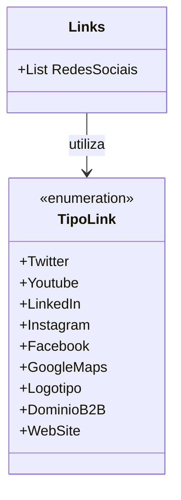

# TipoLink

**Namespace**: IsthmusWinthor.Dominio.Enumeradores  
**Nome do Arquivo**: TipoLink.cs  

`TipoLink` é um enumerador que categoriza diferentes tipos de links disponíveis para um domínio, abrangendo plataformas de redes sociais e outros tipos de links relevantes.

---

# Links

**Namespace**: IsthmusWinthor.Dominio.Enumeradores  
**Nome do Arquivo**: Links.cs  

## Visão Geral e Responsabilidade
A classe `Links` serve como um repositório para a lista estática de redes sociais definidas pelo enumerador `TipoLink`. Ela centraliza a categorização de links de redes sociais, permitindo fácil acesso e manutenção da lista. Este design ajuda a evitar duplicidade e a assegurar que apenas os tipos de links corretos sejam utilizados em diferentes partes da aplicação.

## Métodos de Negócio
- **Título**: RedesSociais (Público)
  - **Objetivo**: Garantir que uma lista de tipos de links de redes sociais esteja disponível de forma centralizada e consistente.
  - **Comportamento**: A propriedade `RedesSociais` inicializa uma lista contendo os tipos de link que correspondem a plataformas de redes sociais, utilizando o enumerador `TipoLink`. Essa propriedade é estática, garantindo que todos os componentes da aplicação tenham acesso à mesma instância da lista, evitando inconsistências.
  - **Retorno**: Retorna uma lista de `TipoLink`, refletindo os tipos de link associados às redes sociais.

## Tipos Auxiliares e Dependências
- Enumerator: 
  - [TipoLink](TipoLink.md)

## Diagrama de Relacionamentos

---
Gerada em 29/12/2025 21:05:20
