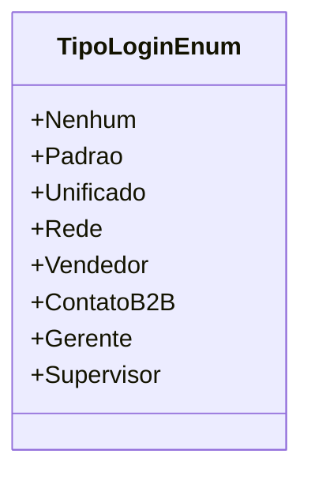

# TipoLoginEnum
**Namespace**: IsthmusWinthor.Dominio.Enumeradores  
**Nome do Arquivo**: TipoLoginEnum.cs

Este enumerador representa os diferentes tipos de login disponíveis no sistema, permitindo a categorização de usuários com base em suas funções e permissões.

## Tipos Auxiliares e Dependências
- **Enumeradores**:
  - [TipoLoginEnum](TipoLoginEnum.md) - Define os possíveis tipos de login que podem ser atribuídos a um usuário.

## Diagrama de Relacionamentos

---
Gerada em 29/12/2025 21:05:26
