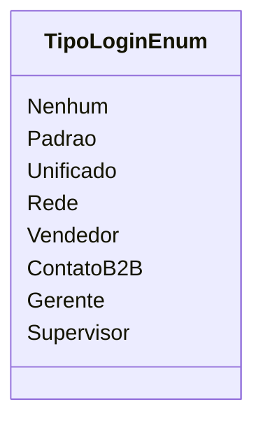

# TipoLoginEnum
- **Namespace**: IsthmusWinthor.Dominio.Enumeradores
- **Nome do Arquivo**: TipoLoginEnum.cs

TipoLoginEnum é um enumerador que define os diferentes tipos de login que podem ser utilizados no sistema. A sua finalidade é facilitar a categorização e a validação do tipo de acesso que um usuário pode ter dentro da aplicação.

## Tipos Auxiliares e Dependências
- **Enumeradores:**
  - `TipoLoginEnum` - Utilizado para categorizar diferentes tipos de login.

## Diagrama de Relacionamentos

