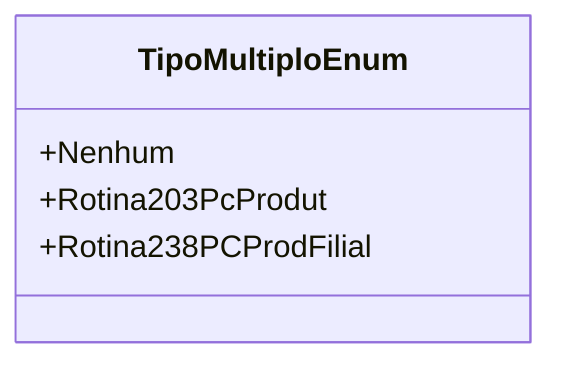

# TipoMultiploEnum
- **Namespace**: IsthmusWinthor.Dominio.Enumeradores
- **Nome do Arquivo**: TipoMultiploEnum.cs

Este enumerador é utilizado para categorizar diferentes tipos de rotinas no sistema, permitindo uma clara identificação e manipulação de múltiplos tipos de processos.

## Tipos Auxiliares e Dependências
- Enumeradores:
  - `Nenhum`: Representa a ausência de um tipo de rotina.
  - `Rotina203PcProdut`: Refere-se a uma rotina específica de processamento de Produto.
  - `Rotina238PCProdFilial`: Representa uma rotina de processamento voltada para Filiais.

## Diagrama de Relacionamentos

