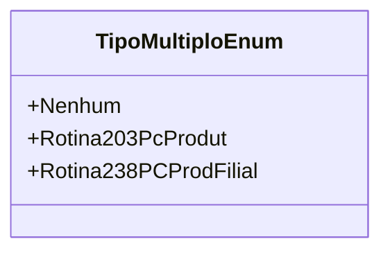

# TipoMultiploEnum
**Namespace**: IsthmusWinthor.Dominio.Enumeradores  
**Nome do Arquivo**: TipoMultiploEnum.cs  

O `TipoMultiploEnum` é um enumerador que define diferentes tipos de múltiplos utilizados dentro da aplicação, permitindo classificar e identificar rotinas específicas que podem ser aplicadas. Este tipo é utilizado para garantir que as rotinas certas sejam invocadas conforme o contexto apropriado.

### Tipos Auxiliares e Dependências
- **Enumeradores**:
  - [TipoMultiploEnum](TipoMultiploEnum.md)

### Diagrama de Relacionamentos

---
Gerada em 29/12/2025 21:05:31
