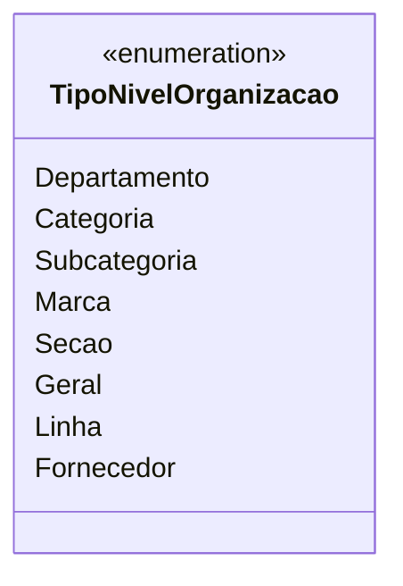

# TipoNivelOrganizacao

**Namespace**: IsthmusWinthor.Dominio.Enumeradores  
**Nome do Arquivo**: TipoNivelOrganizacao.cs  

O enum `TipoNivelOrganizacao` define os diferentes níveis de organização disponíveis dentro de um sistema de categorização. Ele é utilizado para especificar a hierarquia e a estrutura organizacional, facilitando a classificação e a busca de entidades relevantes ao negócio.

## Tipos Auxiliares e Dependências
- Nenhuma classe complexa ou DTO/ViewModel associada.  
- Enum utilizado: `[TipoNivelOrganizacao](TipoNivelOrganizacao.md)`.

## Diagrama de Relacionamentos

