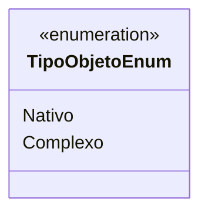

# TipoObjetoEnum
**Namespace**: IsthmusWinthor.Dominio.Enumeradores  
**Nome do Arquivo**: TipoObjetoEnum.cs  

O `TipoObjetoEnum` é um enumerador que define os tipos disponíveis para um objeto no sistema, facilitando a categorização eficaz e o tratamento lógico dos objetos.

## Tipos Auxiliares e Dependências
- **Enumeradores**:
  - `TipoObjetoEnum`: Representa os tipos de objeto possíveis, que são:
    - `Nativo`: Indica um objeto simples ou primitivo.
    - `Complexo`: Indica um objeto que pode conter múltiplas características ou propriedades relacionadas.

## Diagrama de Relacionamentos

