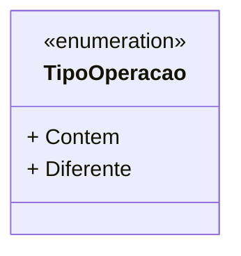

# TipoOperacao
**Namespace**: IsthmusWinthor.Dominio.Enumeradores  
**Nome do Arquivo**: TipoOperacao.cs

Este enumerador define os tipos de operações que podem ser utilizados nas validações e filtragens de dados dentro do sistema.

## Tipos Auxiliares e Dependências
- Enumeradores:
  - [TipoOperacao](TipoOperacao.md) - Define os tipos de operações: "Contém" e "Diferente".

## Diagrama de Relacionamentos

---
Gerada em 29/12/2025 21:05:43
