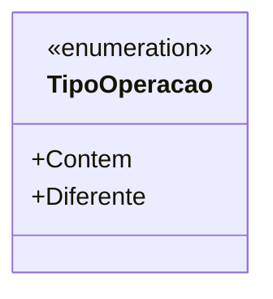

# TipoOperacao
**Namespace**: IsthmusWinthor.Dominio.Enumeradores  
**Nome do Arquivo**: TipoOperacao.cs  

O `TipoOperacao` é um enumerador que representa os tipos de operações que podem ser realizadas em um contexto de comparação de dados. Ele é utilizado para definir regras de negócios que exigem uma lógica específica baseada em operações, facilitando a manutenção e a legibilidade do código.

## Métodos de Negócio
Nenhum método de negócios é implementado neste enumerador, pois ele serve exclusivamente para definir constantes que serão utilizadas na lógica de comparação em outras partes do sistema.

## Propriedades Calculadas e de Validação
Nenhuma propriedade calculada ou de validação é aplicável a este enumerador, uma vez que ele é um simples container para constantes.

## Navigations Property
Nenhuma propriedade de navegação está presente neste enumerador, pois ele consiste apenas em valores enumerados.

## Tipos Auxiliares e Dependências
- Nenhum tipo auxiliar ou dependência é utilizado neste enumerador.

## Diagrama de Relacionamentos

Este diagrama ilustra as duas opções disponíveis no enumerador `TipoOperacao`, que são as operações que podem ser realizadas.
