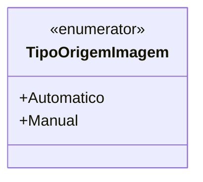

# TipoOrigemImagem
**Namespace**: IsthmusWinthor.Dominio.Enumeradores  
**Nome do Arquivo**: TipoOrigemImagem.cs  

O `TipoOrigemImagem` é um enumerador que serve para categorizar a origem das imagens, permitindo uma melhor organização e manipulação dos dados relacionados a diferentes tipos de origem.

## Tipos Auxiliares e Dependências
- Nenhum.

## Diagrama de Relacionamentos

