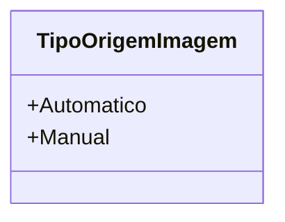

# TipoOrigemImagem
**Namespace**: IsthmusWinthor.Dominio.Enumeradores  
**Nome do Arquivo**: TipoOrigemImagem.cs  

Esta classe é um enumerador que define as origens possíveis de uma imagem, sendo utilizado em diferentes contextos onde a origem da imagem precisa ser especificada. 

## Tipos Auxiliares e Dependências
- **Enumeradores**:
  - [TipoOrigemImagem](TipoOrigemImagem.md)

## Diagrama de Relacionamentos

---
Gerada em 29/12/2025 21:05:46
