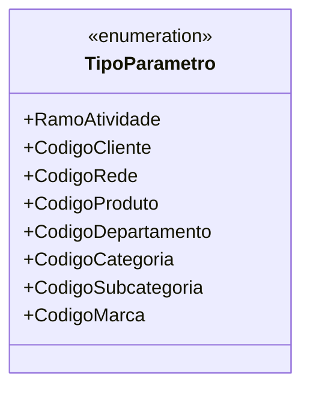

# TipoParametro

**Namespace**: IsthmusWinthor.Dominio.Enumeradores  
**Nome do Arquivo**: TipoParametro.cs  

O `TipoParametro` é uma enumeração que define constantes para representar diferentes tipos de parâmetros utilizados no sistema. Sua finalidade é oferecer uma forma padronizada e tipada de referenciar esses parâmetros, reduzindo o risco de erros que poderiam ocorrer ao utilizar valores literais em string ou números.

## Tipos Auxiliares e Dependências
- Nenhuma dependência de classe complexa do domínio.
- Enumeração: 
  - `[TipoParametro](TipoParametro.md)`

## Diagrama de Relacionamentos

