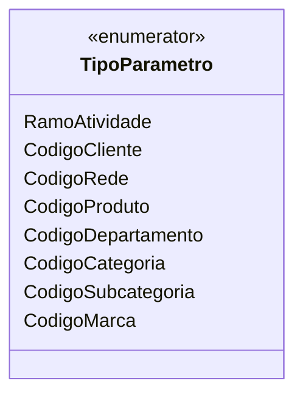

# TipoParametro
**Namespace**: IsthmusWinthor.Dominio.Enumeradores  
**Nome do Arquivo**: TipoParametro.cs  

TipoParametro é um enumerador que define uma série de constantes que representam diferentes códigos que podem ser utilizados no sistema para categorizar e identificar parâmetros em diversas operações.

### Tipos Auxiliares e Dependências
- Enumerador: [TipoParametro](TipoParametro.md)

### Diagrama de Relacionamentos

---
Gerada em 29/12/2025 21:05:50
