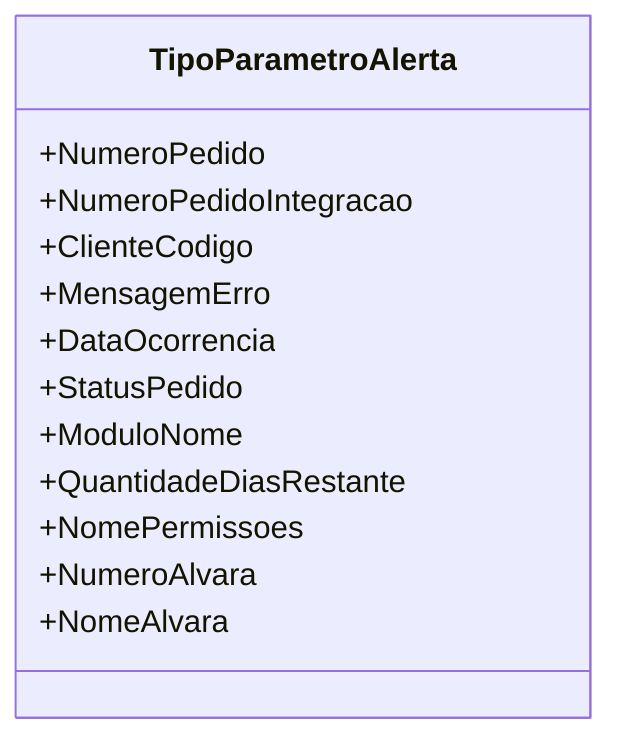

# TipoParametroAlerta

**Namespace**: IsthmusWinthor.Dominio.Enumeradores  
**Nome do Arquivo**: TipoParametroAlerta.cs  

O enum `TipoParametroAlerta` categoriza os diferentes tipos de parâmetros utilizados para alertas dentro do sistema, facilitando a identificação e manipulação dos dados relevantes para notificações de eventos específicos relacionados aos pedidos e ocorrências.

## Tipos Auxiliares e Dependências
- Nenhum enumerador ou classe auxiliar explícita além do próprio `TipoParametroAlerta` é utilizado nesta classe. Contudo, é importante observar que os valores deste enum podem ser utilizados em outros contextos para definir quais informações devem ser incluídas em alertas.

## Diagrama de Relacionamentos

