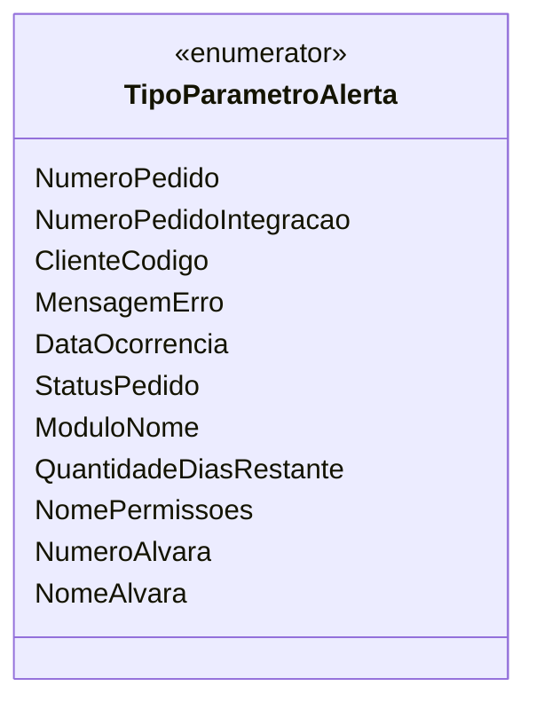

# TipoParametroAlerta
**Namespace**: IsthmusWinthor.Dominio.Enumeradores  
**Nome do Arquivo**: TipoParametroAlerta.cs  

Este enumerador define os tipos de parâmetros que podem ser utilizados em alertas dentro do sistema. Ele transporta dados de forma estruturada para facilitar o gerenciamento e utilização desses parâmetros em diferentes contextos do sistema.  

## Tipos Auxiliares e Dependências
- Nenhum enumerador ou classe auxiliar adicional é utilizado por esta classe.

## Diagrama de Relacionamentos

---
Gerada em 29/12/2025 21:05:55
