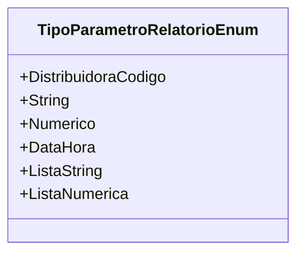

# TipoParametroRelatorioEnum
**Namespace**: IsthmusWinthor.Dominio.Enumeradores  
**Nome do Arquivo**: TipoParametroRelatorioEnum.cs  

## Visão Geral e Responsabilidade
A classe `TipoParametroRelatorioEnum` define um enumerador que categoriza diferentes tipos de parâmetros que podem ser utilizados na geração de relatórios dentro do sistema. Esses tipos de parâmetros orientam como os dados são inseridos e exibidos na interface do usuário, permitindo a configuração flexível e intuitiva dos relatórios.

## Métodos de Negócio
- **Título**: Não se aplica (Enum sem métodos complexos)
- **Objetivo**: O propósito deste enumerador é facilitar a seleção e a descrição dos tipos de parâmetros de relatório, garantindo que os dados sejam apresentados corretamente conforme o tipo selecionado.
- **Comportamento**: Cada valor do enumerador representa um tipo específico de parâmetro. O uso do enum permite que o sistema saiba como tratar e apresentar cada tipo de dado (por exemplo, se é uma lista de textos ou um número).
- **Retorno**: O valor associado a cada tipo de parâmetro retorna um inteiro que identifica o tipo específico de maneira única.

## Propriedades Calculadas e de Validação
- Nenhuma propriedade calculada ou de validação a ser listada, já que se trata de um enumerador simples.

## Navigations Property
- Nenhuma Navigation Property a ser listada, já que se trata de um enumerador simples.

## Tipos Auxiliares e Dependências
- Nenhum tipo auxiliar ou dependência a ser listado, já que se trata de um enumerador simples.

## Diagrama de Relacionamentos

