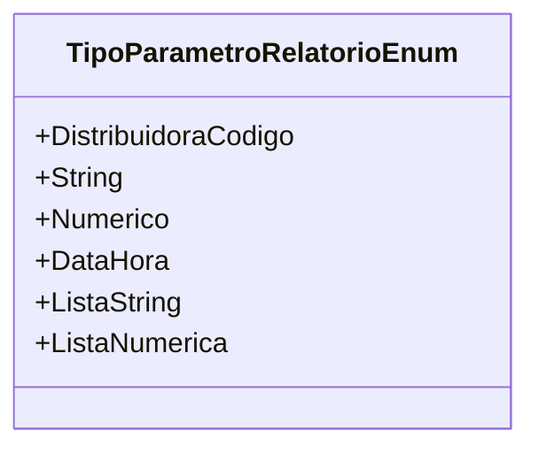

# TipoParametroRelatorioEnum
**Namespace**: IsthmusWinthor.Dominio.Enumeradores  
**Nome do Arquivo**: TipoParametroRelatorioEnum.cs  

Este é um enumerador que define os tipos de parâmetros que podem ser utilizados em relatórios. Ele visa estruturar e categorizar os dados que podem ser recebidos e manipulados em relatórios no sistema, assegurando que o tipo correto de dado seja utilizado em cada contexto.

## Propriedades Calculadas e de Validação
Este enumerador não possui propriedades calculadas ou de validação, uma vez que é um simples conjunto de constantes.

## Navigations Property
Este é um enumerador e não possui propriedades que agrupam classes complexas do domínio.

## Tipos Auxiliares e Dependências
Nenhum tipo auxiliar ou dependência significativa fora do próprio enumerador.

## Diagrama de Relacionamentos

---
Gerada em 29/12/2025 21:06:01
