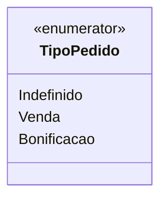

# TipoPedido
**Namespace**: IsthmusWinthor.Dominio.Enumeradores  
**Nome do Arquivo**: TipoPedido.cs  

O `TipoPedido` é um enumerador que representa diferentes tipos de pedidos no sistema, permitindo a categorização entre vendas e bonificações, o que é crucial para a gestão de processos de venda e sua análise.

## Tipos Auxiliares e Dependências
- **Enumeradores**:
  - [TipoPedido](TipoPedido.md) 

## Diagrama de Relacionamentos

---
Gerada em 29/12/2025 21:06:06
