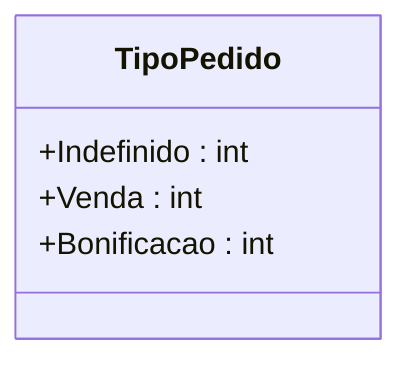

# TipoPedido
**Namespace**: IsthmusWinthor.Dominio.Enumeradores  
**Nome do Arquivo**: TipoPedido.cs  

O `TipoPedido` é um enumerador que define diferentes tipos de pedidos no domínio do sistema. Ele fornece valores semânticos que ajudam na identificação e categorização dos pedidos, facilitando a implementação de regras de negócio específicas para cada tipo de transação.

## Tipos Auxiliares e Dependências
- **Enumeradores:**
  - `[TipoPedido](TipoPedido.md)` - Enumerador que categoriza os tipos de pedidos.

## Diagrama de Relacionamentos

