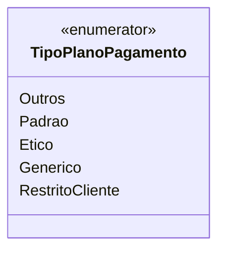

# TipoPlanoPagamento
**Namespace**: IsthmusWinthor.Dominio.Enumeradores  
**Nome do Arquivo**: TipoPlanoPagamento.cs  

O `TipoPlanoPagamento` é um enumerador que define os diferentes tipos de planos de pagamento disponíveis no sistema. Ele fornece uma maneira eficaz de categorizar os planos, garantindo que apenas valores válidos sejam utilizados em processos de negociação e cobrança.

## Tipos Auxiliares e Dependências
- Nenhum

## Diagrama de Relacionamentos

