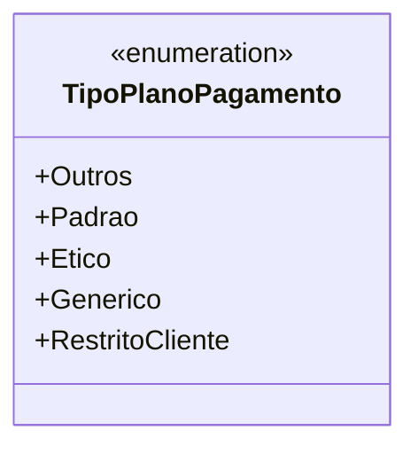

# TipoPlanoPagamento
**Namespace**: IsthmusWinthor.Dominio.Enumeradores  
**Nome do Arquivo**: TipoPlanoPagamento.cs  

O `TipoPlanoPagamento` é um enumerador que define diferentes tipos de planos de pagamento utilizados no sistema. Ele categoriza os métodos de pagamento que podem ser aplicados a transações financeiras, garantindo que apenas valores previamente definidos estejam em uso, o que facilita a validação e a consistência dos dados.

## Tipos Auxiliares e Dependências
- **Enumeradores:**
  - [TipoPlanoPagamento](TipoPlanoPagamento.md)  

---
Gerada em 29/12/2025 21:06:11
