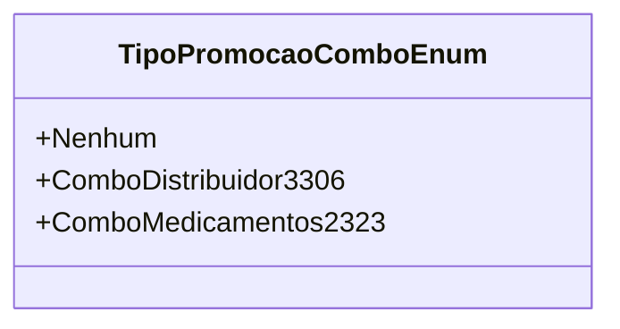

# TipoPromocaoComboEnum
**Namespace**: IsthmusWinthor.Dominio.Enumeradores  
**Nome do Arquivo**: TipoPromocaoComboEnum.cs  

O `TipoPromocaoComboEnum` é um enumerador que define diferentes tipos de promoções que podem ser aplicadas no sistema. Ele serve para padronizar as opções de promoções de combos, facilitando a manipulação e comparação de tais valores ao longo do sistema.

## Tipos Auxiliares e Dependências
- Nenhum.

## Diagrama de Relacionamentos

---
Gerada em 29/12/2025 21:06:15
