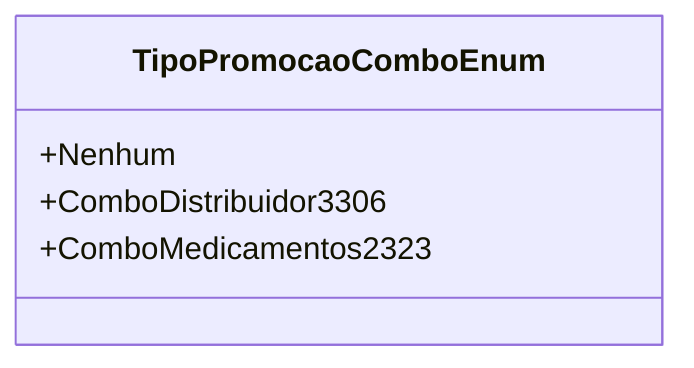

# TipoPromocaoComboEnum

**Namespace**: IsthmusWinthor.Dominio.Enumeradores  
**Nome do Arquivo**: TipoPromocaoComboEnum.cs

Este enumerador define os tipos de promoção disponíveis no sistema, servindo como um meio de transporte para categorizar promoções de forma consistente em outras partes da aplicação.

### Tipos Auxiliares e Dependências
- **Enumerações**:
  - `TipoPromocaoComboEnum` - Representa diferentes tipos de promoção para combos disponíveis no sistema.

### Diagrama de Relacionamentos

