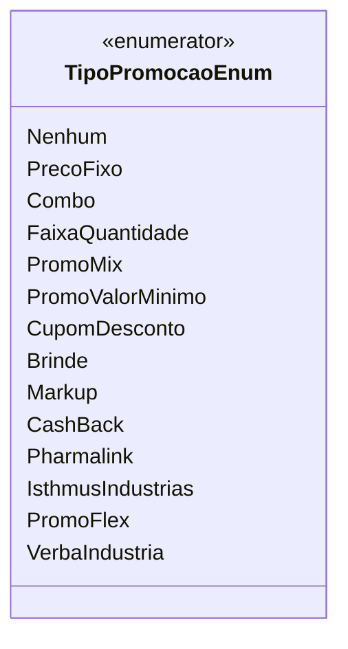

# TipoPromocaoEnum
**Namespace**: IsthmusWinthor.Dominio.Enumeradores  
**Nome do Arquivo**: TipoPromocaoEnum.cs  

O `TipoPromocaoEnum` é um enumerador que define os diferentes tipos de promoções disponíveis no sistema. Ele serve como um meio para categorizar as promoções que podem ser aplicadas a produtos ou serviços, facilitando a implementação de regras de negócio específicas para cada tipo.

## Tipos Auxiliares e Dependências
- Nenhum

## Diagrama de Relacionamentos

