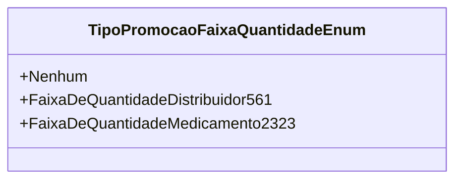

# TipoPromocaoFaixaQuantidadeEnum
**Namespace**: IsthmusWinthor.Dominio.Enumeradores  
**Nome do Arquivo**: TipoPromocaoFaixaQuantidadeEnum.cs  

O `TipoPromocaoFaixaQuantidadeEnum` é um enumerador que define os diferentes tipos de promoções baseadas em faixas de quantidade. Ele é utilizado para categorizar e identificar as promoções disponíveis em um sistema, facilitando a lógica de negócio relacionada às negociações e vendas de produtos em quantidades específicas.

### Tipos Auxiliares e Dependências
- Nenhum

### Diagrama de Relacionamentos

Este enumerador é um componente essencial para o funcionamento de regras que determinam a aplicação de promoções, ajudando a garantir que as promoções corretas sejam aplicadas em função da faixa de quantidade de produtos.
---
Gerada em 29/12/2025 21:06:22
