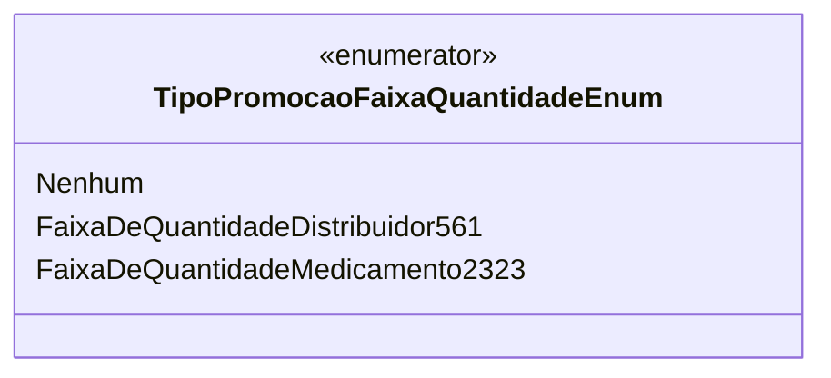

# TipoPromocaoFaixaQuantidadeEnum
**Namespace**: IsthmusWinthor.Dominio.Enumeradores  
**Nome do Arquivo**: TipoPromocaoFaixaQuantidadeEnum.cs  

O `TipoPromocaoFaixaQuantidadeEnum` é um enumerador que define diferentes tipos de faixa de quantidade para promoções. Este tipo é utilizado na lógica do domínio para categorizar e aplicar regras específicas de promoção de acordo com cada faixa.

## Tipos Auxiliares e Dependências
- Nenhum

## Diagrama de Relacionamentos

