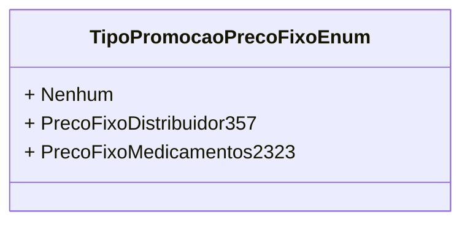

# TipoPromocaoPrecoFixoEnum
**Namespace**: IsthmusWinthor.Dominio.Enumeradores   
**Nome do Arquivo**: TipoPromocaoPrecoFixoEnum.cs  

### Descrição
Este é um enumerador que representa os diferentes tipos de promoção disponíveis, especificamente para preços fixos na aplicação. Ele é utilizado para categorizar e identificar as promoções que podem ser aplicadas a produtos, facilitando a lógica de precificação e as regras de negócios relacionadas.

### Tipos Auxiliares e Dependências
- **Nenhum**: Representa a ausência de uma promoção.
- **PrecoFixoDistribuidor357**: Indica uma promoção de preço fixo específica para distribuidores.
- **PrecoFixoMedicamentos2323**: Indica uma promoção de preço fixo específica para medicamentos.

### Diagrama de Relacionamentos

Este diagrama representa as constantes do enumerador `TipoPromocaoPrecoFixoEnum`, evidenciando diferentes tipos de promoção que podem ser utilizados no sistema.
---
Gerada em 29/12/2025 21:06:29
