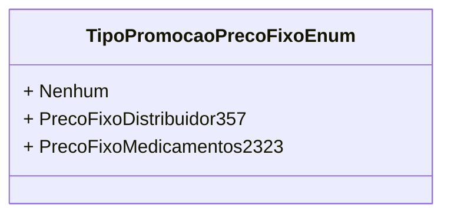

# TipoPromocaoPrecoFixoEnum
**Namespace**: IsthmusWinthor.Dominio.Enumeradores  
**Nome do Arquivo**: TipoPromocaoPrecoFixoEnum.cs  

O `TipoPromocaoPrecoFixoEnum` é um enumerador utilizado para categorizar tipos de promoções de preços fixos dentro do sistema, assegurando que apenas valores válidos sejam utilizados durante o processamento de regras de negócio relacionadas a precificação.

## Tipos Auxiliares e Dependências
- **Enumeradores:**
  - `[TipoPromocaoPrecoFixoEnum](TipoPromocaoPrecoFixoEnum.md)`

## Diagrama de Relacionamentos

