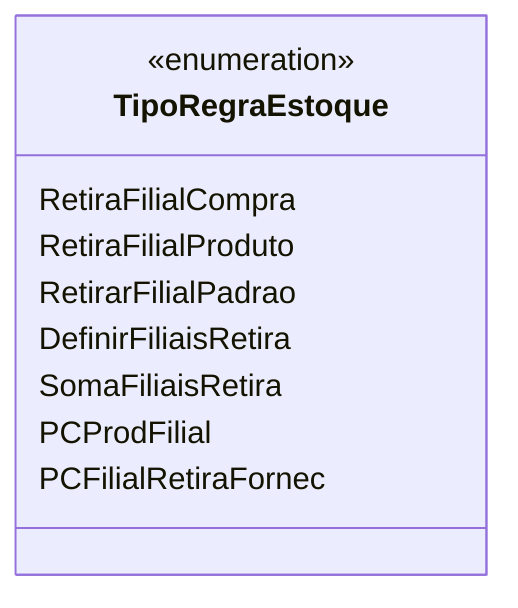

# TipoRegraEstoque
**Namespace**: IsthmusWinthor.Dominio.Enumeradores  
**Nome do Arquivo**: TipoRegraEstoque.cs  

`TipoRegraEstoque` é um enumerador utilizado para definir as diferentes regras de retirada de estoque dentro do sistema, permitindo flexibilidade na gestão de estoques de filiais conforme as necessidades do negócio.

## Métodos de Negócio
Este enumerador não possui métodos de negócio complexos, pois é simplesmente uma definição de constantes que representam as regras de estoque.

## Propriedades Calculadas e de Validação
Este enumerador não possui propriedades calculadas ou validações.

## Navigations Property
Este enumerador não contém propriedades de navegação, pois é uma lista de constantes.

## Tipos Auxiliares e Dependências
Classes auxiliares e dependências não são aplicáveis a este enumerador.

## Diagrama de Relacionamentos

