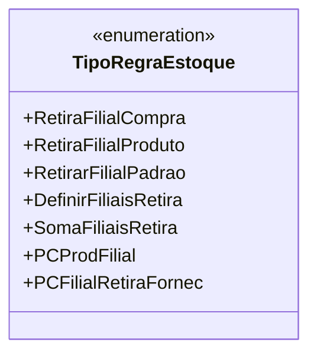

# TipoRegraEstoque
**Namespace**: IsthmusWinthor.Dominio.Enumeradores  
**Nome do Arquivo**: TipoRegraEstoque.cs  

## Visão Geral e Responsabilidade
A classe `TipoRegraEstoque` é um enumerador que define diferentes estratégias para a retirada de estoque em um sistema de gestão de vendas. Cada opção de regra fornece diretrizes sobre como o estoque deve ser alocado, permitindo que o processo de retirada seja flexível e adaptável às necessidades específicas de cada operação, considerando variáveis como filial de compra, filiais associadas e configurações de produtos.

## Métodos de Negócio
Não existem métodos com lógica de negócio nesta enumeração, pois é composta apenas por constantes que definem regras de estoque.

## Propriedades Calculadas e de Validação
Não há propriedades calculadas ou de validação nesta enumeração. Todos os membros são enumerações fixas sem lógica associada.

## Navigation Property
Não há propriedades de navegação nesta enumeração, pois todas as definições são de enumeração e não referenciam outras classes ou entidades do domínio.

## Tipos Auxiliares e Dependências
Não há enumeradores adicionais ou classes estáticas/Helpers referenciadas por esta enumeração.

## Diagrama de Relacionamentos

---
Gerada em 29/12/2025 21:06:37
